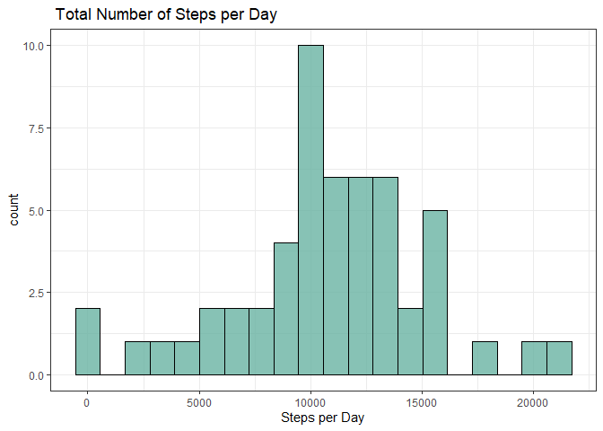
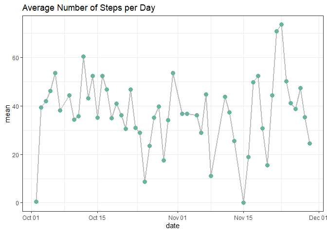
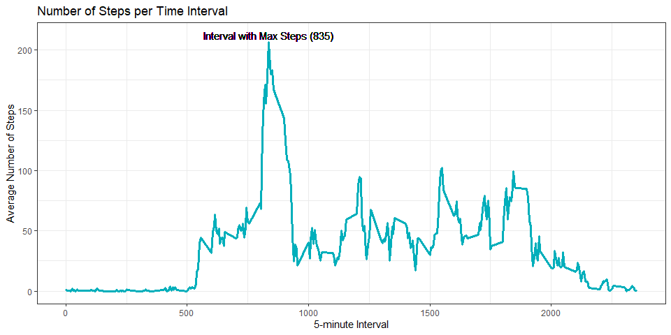
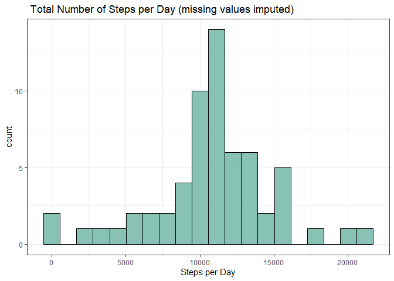
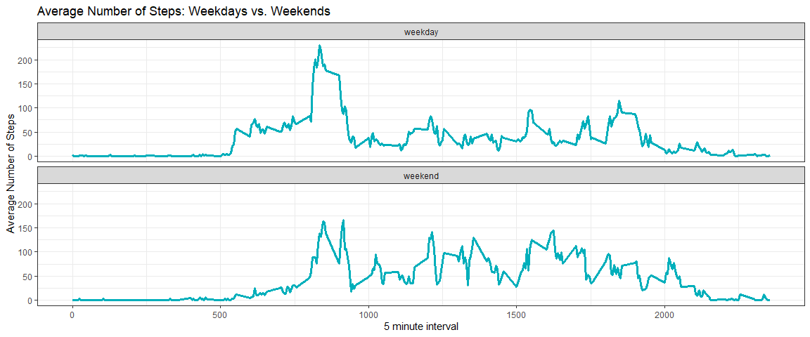

```r
library(readr)
library(lubridate)
library(tidyverse)
```

$~$

## Loading and preprocessing the data  

$~$


```r
activity <- read_csv(unz("activity.zip", "activity.csv"), show_col_types = FALSE)

activity$date <- as.Date(activity$date)
```

$~$

## Total number of steps taken each day

$~$


```r
Total_Steps <- activity %>% 
            group_by(date) %>% 
            drop_na() %>% 
            summarise(steps_per_day = sum(steps))
```


```r
ggplot(Total_Steps, aes(steps_per_day)) + 
  geom_histogram(bins = 20, fill = "#69b3a2", alpha = 0.8, color = "black")+
  labs(title = " Total Number of Steps per Day",
      x = "Steps per Day") +
  theme_bw()
```

<!-- -->

$~$

## Mean and median of the total number of steps taken per day

$~$


```r
print(
  mean(Total_Steps$steps_per_day, na.rm = TRUE)
    )
```

```
## [1] 10766.19
```

$~$


```r
print(
  median(Total_Steps$steps_per_day, na.rm = TRUE)
     )
```

```
## [1] 10765
```

$~$

## Average daily activity pattern 

$~$


```r
Steps_Summary <- activity %>% 
                  group_by(date) %>% 
                  drop_na() %>% 
                  summarise(mean = mean(steps)) 
```


```r
Steps_Summary %>% 
  ggplot(aes(date,mean)) + 
  geom_line(size = 1, color = "grey") +
  geom_point(size = 3, color  = "#69b3a2") +
  labs(title = "Average Number of Steps per Day") +
  theme_bw()
```

<!-- -->

$~$

## Average activity pattern per interval

$~$


```r
Interval_Summary <- activity %>% 
                  group_by(interval) %>% 
                  drop_na() %>% 
                  summarise(mean = mean(steps))  
```

$~$

#### Interval with the maximum activity 

```r
Interval_Summary_ordered <-arrange(Interval_Summary, desc(mean))

print(
  Interval_Summary_ordered[1, ]
      ) 
```

```
## # A tibble: 1 x 2
##   interval  mean
##      <dbl> <dbl>
## 1      835  206.
```

$~$

#### Time series plot of the average number of steps taken per interval 

```r
Interval_Summary %>% 
  ggplot(aes(interval,mean)) + 
  geom_line(size = 1.2, color = "#00AFBB") +
  geom_text(aes(x = 835, y = 212, label = "Interval with Max Steps (835)")) +
  labs(title = "Number of Steps per Time Interval",
       x = "5-minute Interval",
       y = "Average Number of Steps") +
  theme_bw()
```

<!-- -->

$~$

## Imputing missing values

$~$

#### Total number of missing values in the dataset 

```r
table(is.na(activity))
```

```
## 
## FALSE  TRUE 
## 50400  2304
```

$~$

#### Devise a strategy for filling in all of the missing values in the dataset. 

```r
Interval_Summary <- activity %>% 
                  group_by( interval) %>% 
                  drop_na() %>% 
                  summarise(mean = mean(steps))


Activity_NAs <- activity %>% filter(is.na(steps))


# missing values imputed by taking the mean total steps taken per interval 

Activity_NAs <- inner_join(Interval_Summary, Activity_NAs, by = "interval") %>% 
                select(mean, date, interval) %>% 
                rename(steps = mean)
```

$~$

#### Create a new dataset that is equal to the original dataset but with the missing data filled in.

```r
Activity_drop_NAs <- activity %>% drop_na()


Activity_Imputed <- rbind(Activity_drop_NAs, Activity_NAs)
```

$~$

#### total number of steps taken each day after missing values are imputed

```r
Total_Steps_Imputed <- Activity_Imputed %>% 
            group_by(date) %>% 
            summarise(steps_per_day = sum(steps))
```

$~$

#### Histogram showing total steps per day after imputing missing values 

```r
ggplot(Total_Steps_Imputed, aes(steps_per_day)) + 
  geom_histogram(bins = 20, fill = "#69b3a2", alpha = 0.8, color = "black")+
  labs(title = " Total Number of Steps per Day (missing values imputed)", 
       x = "Steps per Day") +
  theme_bw()
```

<!-- -->

$~$

## Are there differences in activity patterns after imputing missing data?

$~$

#### Calculate and report the mean total number of steps taken per day

```r
#  mean total number of steps taken per day

print(
  mean(Total_Steps_Imputed$steps_per_day)
    )
```

```
## [1] 10766.19
```
 
$~$ 


```r
#  median total number of steps taken per day
print(
  median(Total_Steps$steps_per_day)
    ) 
```

```
## [1] 10765
```

$~$

The mean and median of total number of steps remains stable, however we see that there is a shift in the 1st and 3rd quantiles.  When including imputed value for NAs, the 1st quantile value increases, while the 3rd quantile value decreases. 

$~$

## Are there differences in activity patterns between weekdays and weekends?

$~$

#### Create a new factor variable in the dataset with two levels – “weekday” and “weekend” 

```r
weekday <- c("Monday", "Tuesday", "Wednesday", "Thursday", "Friday")

weekend <- c("Saturday", "Sunday")

Activity_Imputed <- Activity_Imputed %>% mutate(Day_of_Week = weekdays(date),
                                                Work_Week = case_when(Day_of_Week %in% weekday ~ "weekday",
                                                                      Day_of_Week %in% weekend ~ "weekend"))
```

$~$

#### Time series plot of activity pattern per interval averaged across all weekday days or weekend days 

```r
Activity_Imputed_Summary <-  Activity_Imputed %>% 
                                    group_by(interval, Work_Week) %>% 
                                    summarise(average_steps = mean(steps))
```

```
## `summarise()` has grouped output by 'interval'. You can override using the `.groups` argument.
```


```r
Activity_Imputed_Summary %>% 
  ggplot(aes(interval, average_steps, groups = Work_Week)) +
  geom_line(size = 1.2, color = "#00AFBB") +
  labs(title = "Average Number of Steps: Weekdays vs. Weekends", 
       x = "5 minute interval", 
       y = "Average Number of Steps ") + 
  facet_wrap(~ Work_Week, ncol = 1)+
  theme_bw()
```

<!-- -->


